## 👾 `./about_me`

  

## 🎯 `RESEARCH & OFFENSIVE SPECIALIZATIONS`

## 🧰 `ARSENAL // TECH STACK MATRIX`

<table>
<tr>
<td width="50%" valign="top">

**`LANGUAGES`**

</td>
<td width="50%" valign="top">

**`FRAMEWORKS & ML`**

</td>
</tr>
<tr>
<td width="50%" valign="top">

**`SECURITY & FORENSICS`** · *primary arsenal*

</td>
<td width="50%" valign="top">

**`EMBEDDED & SYSTEMS`**

</td>
</tr>
</table>

## 📡 `TELEMETRY COMMAND // GITHUB STATS`

## 🐍 `GH_HEATMAP // RETRO SNAKE`

  <picture>
    <source media="(prefers-color-scheme: dark)" srcset="https://raw.githubusercontent.com/sainivedhh/sainivedhh/output/github-snake-dark.svg" />
    <source media="(prefers-color-scheme: light)" srcset="https://raw.githubusercontent.com/sainivedhh/sainivedhh/output/github-snake.svg" />
    
  </picture>

## 🗂️ `FEATURED RESEARCH & PROJECT ARTIFACTS`

<table>
<tr>
<td width="50%" valign="top">

### [MouseControl-ML](https://github.com/sainivedhh/MouseControl-ML) `VISION_AI`
Control the mouse with hand gestures and eye tracking using OpenCV, MediaPipe and PyAutoGUI. Cursor movement, blink-to-click and pinch-to-drag.

`Python` `OpenCV` `MediaPipe`

</td>
<td width="50%" valign="top">

### [YumWell-WebDevt](https://github.com/sainivedhh/YumWell-WebDevt) `FULL_STACK`
Full-stack e-commerce web app for online food ordering: browse the menu, add to cart and track orders.

`CSS` `JavaScript`

</td>
</tr>
<tr>
<td width="50%" valign="top">

### [TaskManager-JS](https://github.com/sainivedhh/TaskManager-JS) `SYSTEMS`
A clean CRUD task manager in vanilla HTML, CSS and JavaScript, built around DOM manipulation, event handling and dynamic rendering.

`HTML` `CSS` `JavaScript`

</td>
<td width="50%" valign="top">

### [ImageFeatureExtraction-ML](https://github.com/sainivedhh/ImageFeatureExtraction-ML) `DEEP_LEARNING`
Image feature extraction pipeline in a Jupyter notebook.

`Python` `Jupyter`

</td>
</tr>
</table>

<a href="https://github.com/sainivedhh?tab=repositories"><code>VIEW ALL REPOSITORIES ↗</code></a>

## 🛰️ `TRANSMIT // ESTABLISH SECURE LINK`

Reachable for research collaborations, security assessments, CTF squads, or engineering internships.

  

